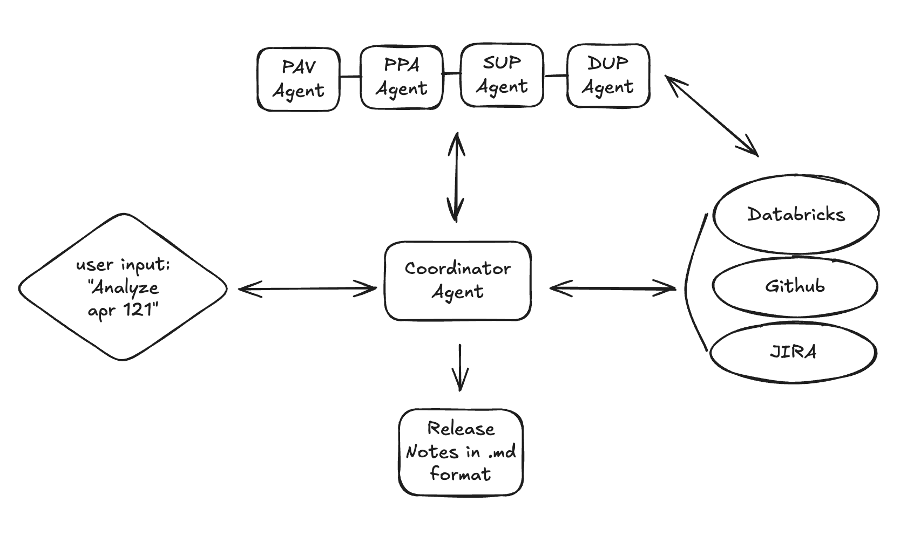

# Orbis POI Control Plan Agents

A multi-agent system for automated analysis of APR (Automated Performance Report) metrics across POI (Point of Interest) validation themes including PAV (POI Availability), PPA (POI Positional Accuracy), SUP (Superfluousness), and DUP (Duplicate) metrics.

## Overview

This system uses Azure AI Agents to analyze map data quality metrics and correlate them with JIRA tickets and pull requests to generate comprehensive release notes. The system consists of:

- **4 Specialized Metric Agents**: PAV, PPA, SUP, DUP - each analyzes specific POI validation metrics
- **1 Coordinator Agent**: Synthesizes findings and links patterns to JIRA tickets
- **Multi-API Integration**: Connects to Databricks, JIRA, and GitHub APIs

## Structure



## Prerequisites

- **Python 3.13.2+**
- **Azure AI Projects account** with agent capabilities
- **Access to APIs**: Databricks, JIRA, GitHub --> populate your own tokens into a .env file. 

## Installation

### 1. Clone the Repository

```bash
git clone <repository-url>
cd orbis-poi-control-plan-agents
```

### 2. Set Up Python Environment

#### Using Virtual Environment
```bash
# Create virtual environment
python -m venv venv

# Activate virtual environment
# On macOS/Linux:
source venv/bin/activate
# On Windows:
venv\Scripts\activate
```

### 3. Install Dependencies

```bash
pip install -r requirements.txt
```

## Configuration

### 1. Environment Variables

Create a `.env` file in the root directory with the following variables:

```env
# Azure AI Configuration
AZURE_EXISTING_AIPROJECT_ENDPOINT=https://your-project.cognitiveservices.azure.com/
MODEL_DEPLOYMENT_NAME=your-model-deployment-name

# Databricks Configuration
DATABRICKS_TOKEN=your-databricks-token
DATABRICKS_HOST=https://your-databricks-instance.azuredatabricks.net
DATABRICKS_WAREHOUSE_ID=your-warehouse-id

# JIRA Configuration
JIRA_DOMAIN=your-domain
JIRA_EMAIL=your-email@company.com
JIRA_API_TOKEN=your-jira-api-token

# GitHub Configuration
GITHUB_API_TOKEN=your-github-token
GITHUB_REPO_OWNER=your-github-username-or-org
GITHUB_REPO_NAME=your-repository-name
```

### 2. Azure AI Setup (Ask @elias-rosenberg for existing creds, but you can create your own too for new projects)

1. **Create Azure AI Project**: 
   - Go to [Azure Portal](https://portal.azure.com)
   - Create a new Azure AI Project resource
   - Note the endpoint URL

2. **Deploy Model**:
   - Deploy a GPT-4 or similar model in your Azure AI Project
   - Note the deployment name

3. **Configure Authentication**:
   - Ensure you're logged in with Azure CLI: `az login`
   - Or set up service principal authentication

### 3. API Access Setup

#### Databricks
1. Generate a personal access token in your Databricks workspace
2. Note your workspace URL and SQL warehouse ID

#### JIRA
1. Generate an API token from your Atlassian account settings
2. Ensure your account has read access to relevant JIRA projects

#### GitHub
1. Create a personal access token with repository read permissions
2. Ensure access to the target repository

## Usage

### Interactive Mode

Run the system in interactive mode through the terminal to analyze APRs:

```bash
python manual_orchestration.py
```

### Available Commands

Once running, you can:

1. **Analyze an APR**: Simply type the APR number
   ```
   You: 121
   ```

2. **Explicit APR Analysis**: 
   ```
   You: analyze APR 121
   ```

3. **Ask Questions**:
   ```
   You: What metrics does the PAV agent analyze?
   You: Fetch me the title for MPOI-3963
   You: What are the pull requests that went into APR 122? 
   ```

4. **To End Terminal Chat**:
   ```
   You: exit || You: quit
   ```

### Example Session

```
🤖 APR Analysis System Ready!
💬 You're chatting with the APR Coordinator
📋 For APR analysis, just provide an APR number (e.g., '121' or 'analyze APR 121')
❓ For general questions, ask normally
🚪 Type 'exit' or 'quit' to end

You: 121

🎯 Running APR analysis for APR 121
🚀 Starting comprehensive APR 121 analysis...
============================================================
🔄 Running PAV analysis for APR 121...
✅ PAV analysis completed (2460 characters)
🔄 Running PPA analysis for APR 121...
✅ PPA analysis completed (3291 characters)
🔄 Running SUP analysis for APR 121...
✅ SUP analysis completed (2659 characters)  
🔄 Running DUP analysis for APR 121...
✅ DUP analysis completed (3110 characters)
🔄 Creating comprehensive final report...
✅ Comprehensive report completed
```

## System Components

### Core Files

- **`manual_orchestration.py`**: Main orchestration system and entry point
- **`agent.py`**: Agent configuration class for Azure AI agents
- **`agent_tools.py`**: Function definitions for agent capabilities

### Instructions & Configuration

- **`metric_instructions.py`**: Instructions for PAV, PPA, SUP, DUP agents
- **`coordinator_instructions.py`**: Instructions for coordinator agent synthesis

### API Integrations

- **`databricks/DatabricksAPI.py`**: Databricks SQL execution interface
- **`jira/JiraAPI.py`**: JIRA ticket analysis interface  
- **`github/GithubAPI.py`**: GitHub pull request interface

### Code Quality

The project includes code quality tools:

```bash
# Format code
black .

# Lint code  
pylint *.py
```
I've configured my IDE to format python code using the default linter on saves. 

### Extending API Integration / Adding tools

1. Create new API class in appropriate directory
2. Add wrapper functions in `agent_tools.py`
3. Update agent function sets as needed
